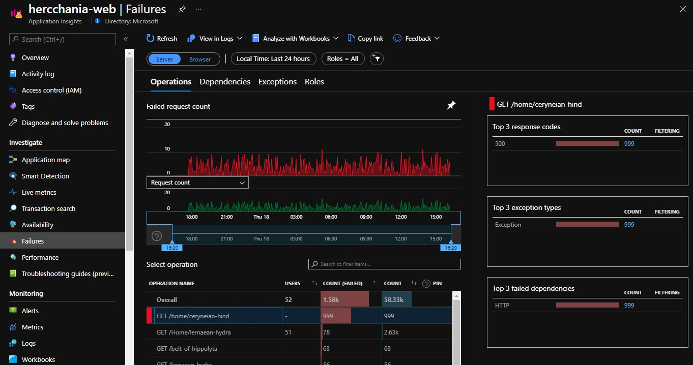
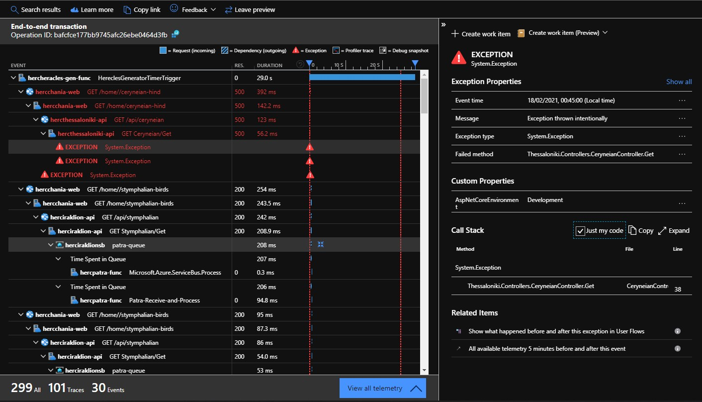

# Answers for the 'Diagnose an exception' challenge

## Which Labour of Heracles generated the most exceptions during our test?

In normal operation, the answer is almost always Cyrenian Hind.

## Which line of code is at fault and causing these exceptions?

`System.Exception:
   at Thessaloniki.Controllers.CeryneianController.Get (thessaloniki, Version=1.0.0.0, Culture=neutral, PublicKeyToken=nullthessaloniki, Version=1.0.0.0, Culture=neutral, PublicKeyToken=null: /home/runner/work/heracles-ai/heracles-ai/thessaloniki/Controllers/CeryneianController.csthessaloniki, Version=1.0.0.0, Culture=neutral, PublicKeyToken=null: 38)`
   
[Line 38](https://github.com/nikkh/heracles-ai/blob/main/thessaloniki/Controllers/CeryneianController.cs).

