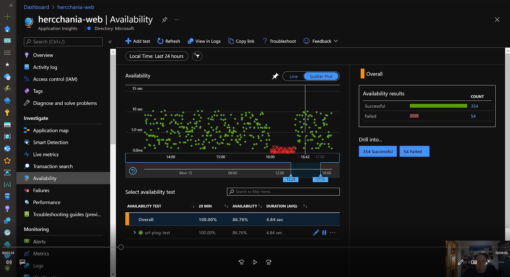

# Availability Monitoring

After you've deployed your web app/website, you can set up recurring tests to monitor availability and responsiveness. Azure Application Insights sends web requests to your application at regular intervals from points around the world. It can alert you if your application isn't responding, or if it responds too slowly.

You can set up availability tests for any HTTP or HTTPS endpoint that is accessible from the public internet. You don't have to make any changes to the website you're testing. In fact, it doesn't even have to be a site you own. You can test the availability of a REST API that your service depends on.

> Both, URL ping test and multi-step web test rely on the public internet DNS infrastructure to resolve the domain names of the tested endpoints. This means that if you are using Private DNS, you must either ensure that every domain name of your test is also resolvable by the public domain name servers or, when it is not possible, you can use custom track availability tests instead.
 
 [See Monitor the availability of any website](https://docs.microsoft.com/en-us/azure/azure-monitor/app/monitor-web-app-availability) or watch a demo below.

# Watch the Availability Monitoring Video

There is a short (6 minute) video that shows failure diagnosis in action:

