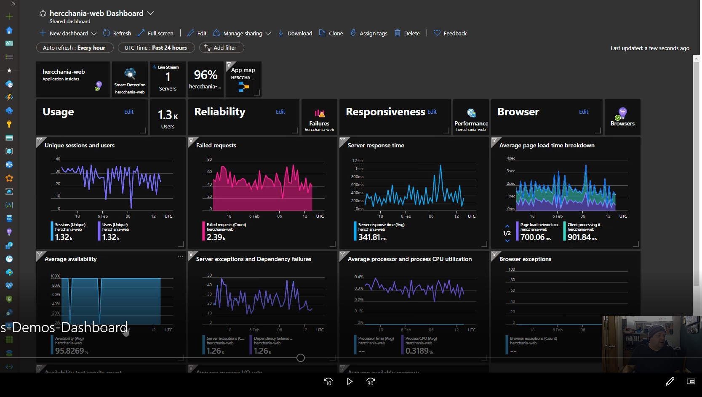

# Dashboard

Dashboards are a focused and organized view of your cloud resources in the Azure portal. Use dashboards as a workspace where you can quickly launch tasks for day-to-day operations and monitor resources. Build custom dashboards based on projects, tasks, or user roles, for example. [See the introduction to Azure Dashboards](https://docs.microsoft.com/en-us/azure/azure-monitor/learn/tutorial-app-dashboards) or watch a demo below.

# Watch the Dashboard Video

There is a short (2 minute) video that shows dashboards in action:

