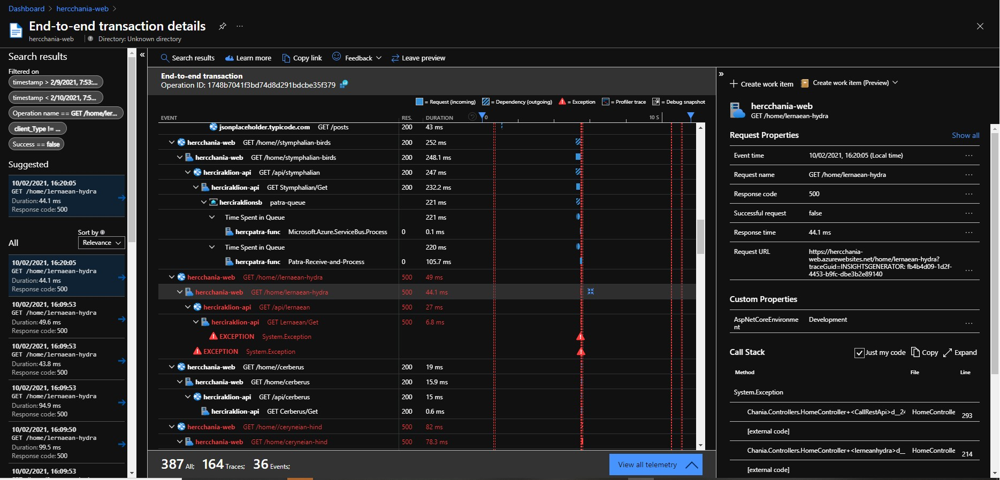

# Failure Diagnosis

The unified diagnostics experience automatically correlates server-side telemetry from across all your Application Insights monitored components into a single view. It doesn't matter if you have multiple resources with separate instrumentation keys. Application Insights detects the underlying relationship and allows you to easily diagnose the application component, dependency, or exception that caused a transaction slowdown or failure.
 
 [See the introduction to Live Metrics](https://docs.microsoft.com/en-us/azure/azure-monitor/app/transaction-diagnostics) or watch a demo below.

# Watch the Failure Diagnosis Video

There is a short (6 minute) video that shows failure diagnosis in action:

