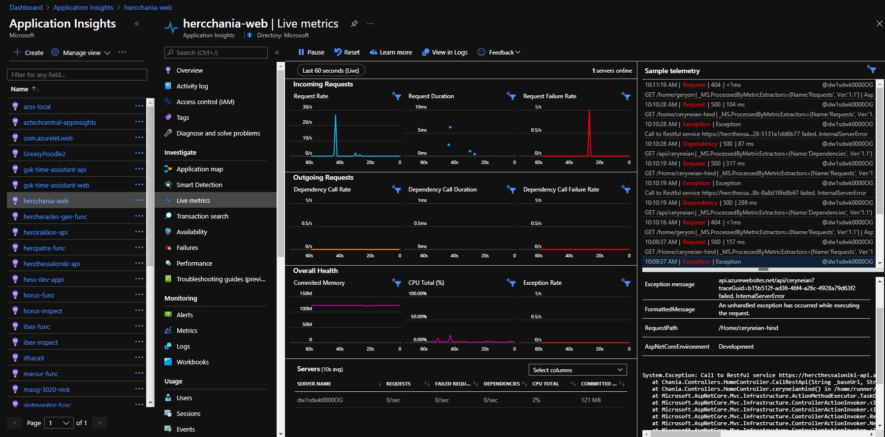

# Live Metrics

You can monitor your live, in-production web application by using Live Metrics Stream (also known as QuickPulse) from Application Insights. You can select and filter metrics and performance counters to watch in real time, without any disturbance to your service. Inspect stack traces from sample failed requests and exceptions. Together with Profiler and Snapshot debugger, Live Metrics Stream provides a powerful and non-invasive diagnostic tool for your live web site.

With Live Metrics Stream, you can:

 - Validate a fix while it is released, by watching performance and failure counts.
 - Watch the effect of test loads, and diagnose issues live.
 - Focus on particular test sessions or filter out known issues, by selecting and filtering the metrics you want to watch.
 - Get exception traces as they happen.
 - Experiment with filters to find the most relevant KPIs.
 - Monitor any Windows performance counter live.
 - Easily identify a server that is having issues, and filter all the KPI/live feed to just that server. 
 
 [See the introduction to Live Metrics](https://docs.microsoft.com/en-us/azure/azure-monitor/app/live-stream) or watch a demo below.

# Watch the Live Metrics Video

There is a short (4 minute) video that shows live metrics in action:

