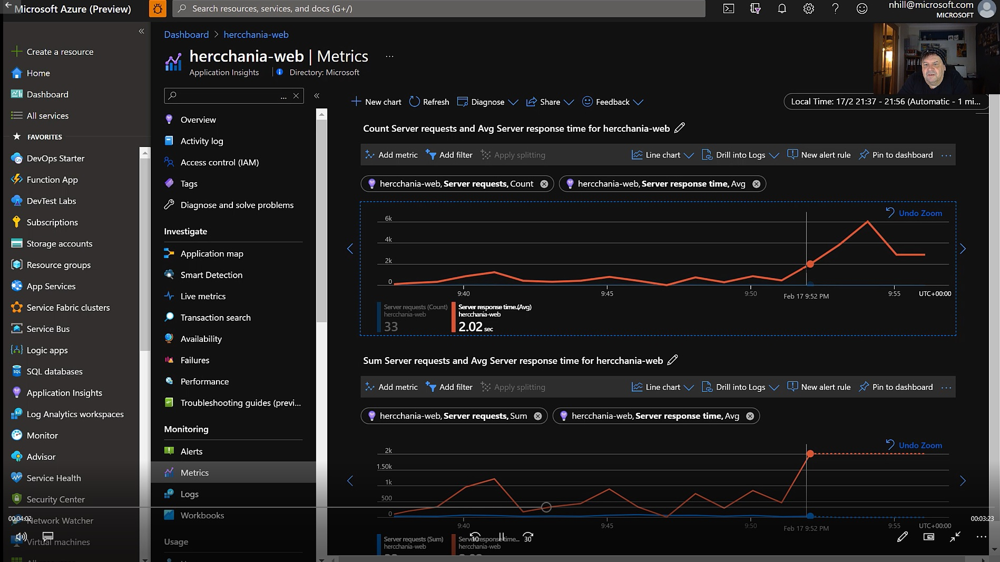

# Metrics

Two types of metrics are available to the users of Application Insights:
 - Log-based metrics
 - Standard metrics

Each type brings a unique value in monitoring application health, diagnostics and analytics. The developers who are instrumenting applications can decide which type of metric is best suited to a particular scenario, depending on the size of the application, expected volume of telemetry, and business requirements for metrics precision and alerting.
 
 [Log-based and pre-aggregated metrics in Application Insights](https://docs.microsoft.com/en-us/azure/azure-monitor/app/pre-aggregated-metrics-log-metrics) or watch a demo below.

# Watch the Metrics Video

There is a short (7 minute) video that shows metrics in action:

