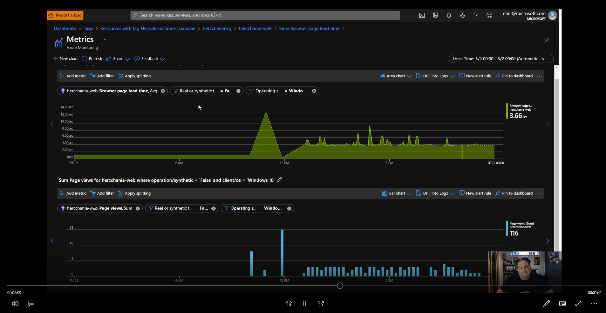

# Smart Detection

Smart Detection automatically warns you of potential performance problems and failure anomalies in your web application. It performs proactive analysis of the telemetry that your app sends to Application Insights. If there is a sudden rise in failure rates, or abnormal patterns in client or server performance, you get an alert. This feature needs no configuration. It operates if your application sends enough telemetry.

You can access the detections issued by Smart Detection both from the emails you receive, and from the Smart Detection blade. [See the introduction to Smart Detection](https://docs.microsoft.com/en-us/azure/azure-monitor/app/proactive-diagnostics) or watch a demo below.

# Watch the Smart Detections Video

There is a short (4 minute) video that shows smart detection map in action:

