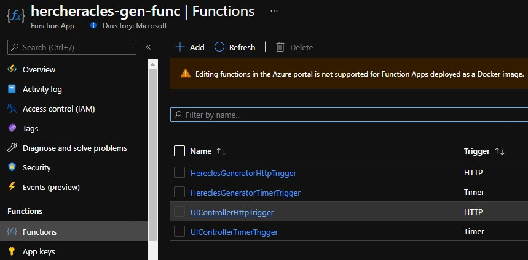

# Synthetic Transactions

One of the most important aspects of Heracles is that a consistent set of behaviours are seen across the Application Insights instances that are used to monitor the application.  This means that you can familiarise youself with what's been happening and how its manifests itself in Application Insights, and this, in turn lets you learn.

All data generation occurs in an Azure Function called <your-alias>heracles-gen-func:
  

The two functions we are interested in are:

- HereclesGeneratorTimerTrigger
- HereclesGeneratorHttpTrigger

HereclesGeneratorTimerTrigger fires every 5 minutes and geenrates a random number of transactions, for a random set of Labours.  This gives consistent but different monitoring every time, similar enought that you can learn, but different enough to provide variety in what we see.

You can also mnually trigger a generation run using a browser.

## Manually Trigger Heracles Generator

In order to do this, you issue a GET request from your browser to the function app url, the generator function will geenrate the NumberOfCalls specified in the url. You can change the number of calls to suit your needs.

So let’s compose this url:
1.	First get the function app url from the Overview page of the function app. It will be something like `https://<your-alias>herecles-gen-func.azurewebsites.net/`
1.	Second get the security code. The function security code means that only people who know this code can call your generator function.  To find the code, open the <your-alias>heracles-rg Resource group in the azure portal, and select the <your-alias>herecles-gen-func azure function.  
1.  Select the Functions option in the left-nav menu
2.  Choose the HeraclesGeneratorHttpTrigger function in the centre pane
3.  In the left menu select Function Keys and press the little 'eye' symbol to reveal the key.
4.  Copy the value for the default key

You can now construct your request url:

`https://<your-alias>hercles-gen-func.azurewebsites.net/api/HeraclesGeneratorHttpTrigger?code=<your-key>&NumberOfCalls=30`
  
Paste this url into your browser and press enter.  After a little while, you should see a success message "HeraclesGenerator generated 30 requests". You can add the result page to browser favourites and generate traffic at the 'touch of a button'.
