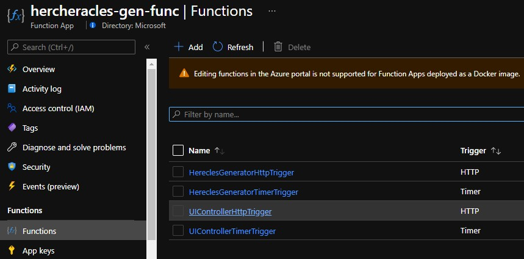

# User Traffic

Application Insights has sophiticated Uer Tracking and Analysis, similar to Google Analytics.  In order to always have a 'fresh supply' of users using your site, Heracles will generate syntehtic user traffic, for authenticated users.

It does this using ChromeDriver, part of the Selenium Nuget packages, that are often used for automated testing.  All data generation occurs in an Azure Function called <your-alias>heracles-gen-func:
  

The two functions we are interested in are:

- UIControllerHttpTrigger
- UIControllerTimerTrigger

UIControllerTimerTrigger fires every 10 minutes and geenrates a random number of user journeys, for a random set of users.  This gives consistent but different monitoring every time, similar enought that you can learn, but different enough to provide variety in what we see.

You can also [manually trigger a generation](manually-trigger-generation.md) run using a browser.

> This functionality is disabled by default.  Once you are happy with your [Active Directory configuration](active-directory-configuration.md) you can enable it by changing configuration setting `HeraclesContext__UserSimulationEnabled` for the <your-alias>heracles-gen-func functionapp to true. 

Once you have completed the above configuration, your can test by accessing the <you-alias>chania-web.azurewebsites.net site, and selecting the *Cattle of Geryon* labour.  this should redirect you to logon at your AAD and on successful logon return you to the application home page as a logged in user.

You can check that User Traffic is being generated by looking in the Application Insights instance for <your-alias>hearcles-gen-func :-)
