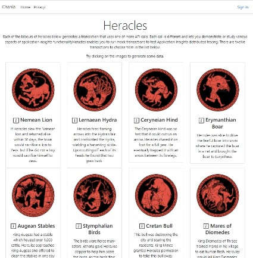

# Heracles Application 

The Heracles application doesn't really do anything.  Each of the Labours of Heracles (Hercules) generates a synthetic transaction that exercises different components of the architecture, and these are in turn instrumented or monitored using Application Insights.  This means that by clicking on the tiles different behaviour will be generated in application insights.

  

This is particularly useful when demonstrating Live Metrics interactively, but the deployment also automtically generates synthetic transactions by regularly invoking the each of the labours, so that you've always got a living application insights data set to explore. You can see the [demo instance](https://hercchania-web.azurewebsites.net) of the application.
